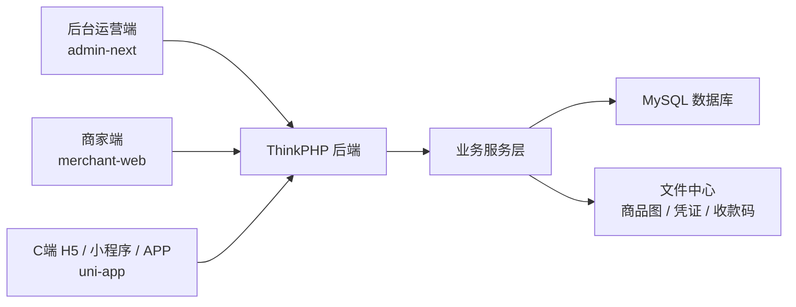
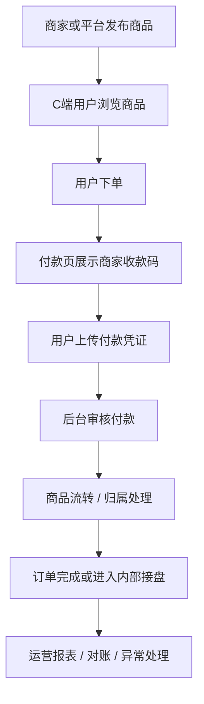
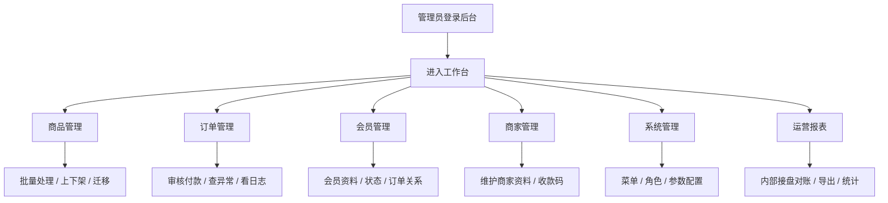
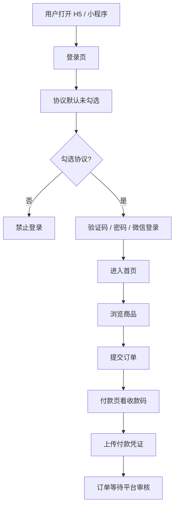
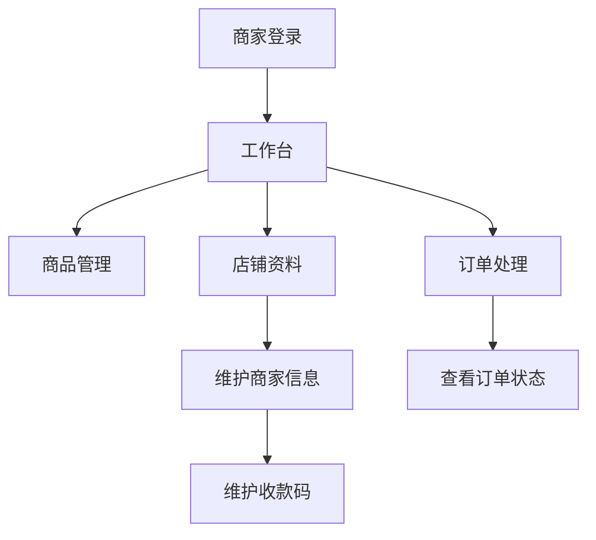
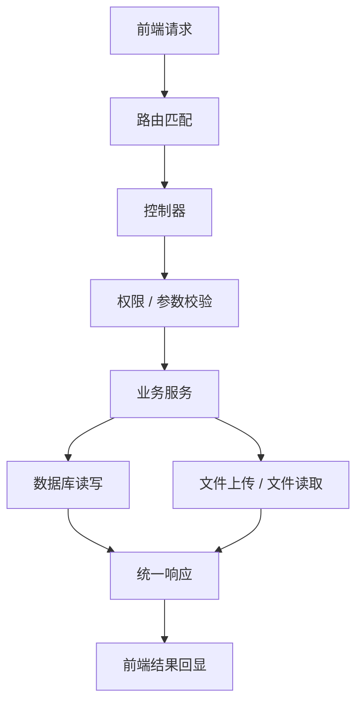
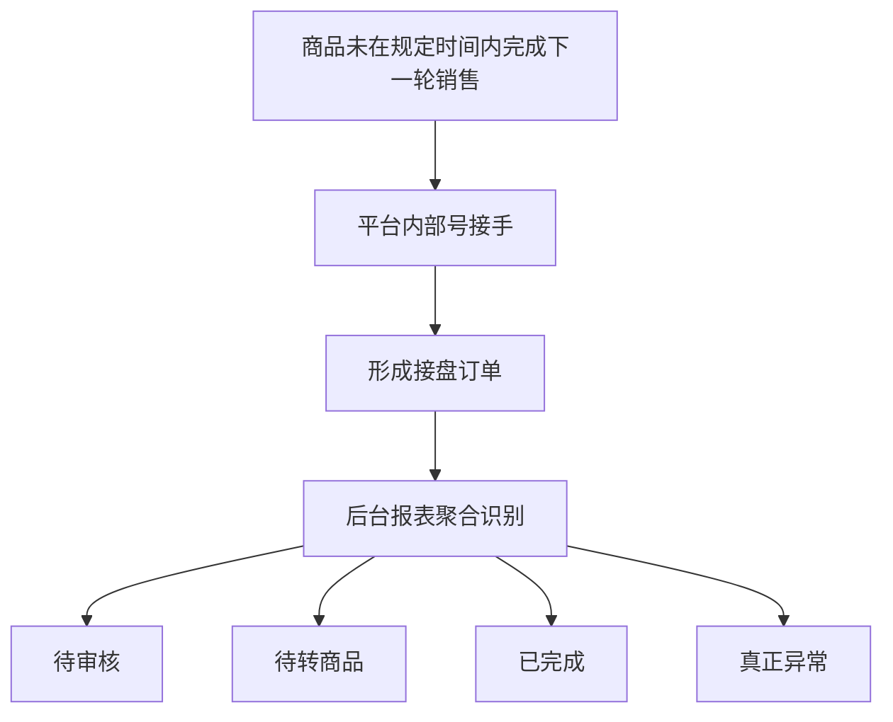
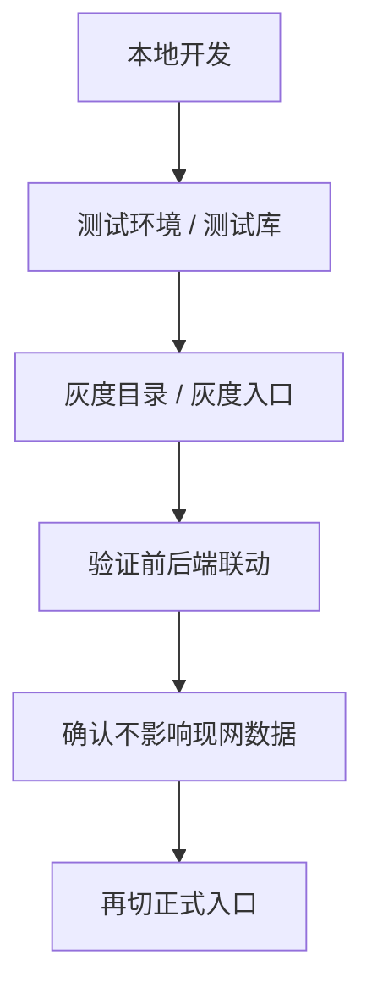

# 系统流程汇报版（PPT 内容底稿）

更新时间：2026-04-30

适用场景：

- 给老板或项目负责人做整体汇报
- 给研发、测试、运营做上线前共识说明
- 作为后续 PPT、PDF、Word 的底稿

## 1. 一句话总览

这套系统由 3 个前端入口和 1 套后端组成，围绕“商品发布、买家下单、平台审核、商品流转、商家承接、运营对账”形成完整闭环。

## 2. 汇报第一页：系统全景图

汇报话术：

- 后台负责运营配置、审核、对账、报表和系统设置
- 商家端负责商品和商家自助操作
- C 端负责用户访问、登录、下单和付款凭证提交
- 后端统一处理业务逻辑、数据存储和文件管理

## 3. 汇报第二页：整体业务闭环

汇报重点：

- 商品不是静态展示，而是有后续流转关系
- 付款不是自动完成，需要平台审核承接
- 内部接盘对账是当前运营闭环的重要补强

## 4. 汇报第三页：后台运营主流程

汇报重点：

- 后台是整套系统的运营控制台
- 当前重点栏目已经从“统一壳子”往“线上操作习惯”靠拢
- 核心目标是可操作、可回显、可追踪、可回退

## 5. 汇报第四页：C 端用户主流程

汇报重点：

- 登录协议默认不勾选，属于固定验收项
- 付款页依赖商家资料里的最新收款码
- 用户感知链路重点是登录顺畅、付款清晰、订单状态可见

## 6. 汇报第五页：商家端主流程

汇报重点：

- 商家资料维护和收款码维护已经成为关键运营支点
- 后续前端付款页展示是否准确，依赖这里的数据完整性

## 7. 汇报第六页：后端处理逻辑

汇报重点：

- 前端只是入口，真正的状态判定在后端
- 订单状态、商品归属、账单、异常识别都要后端统一口径

## 8. 汇报第七页：内部接盘对账的意义

汇报重点：

- 不是所有积压都是异常
- 需要把“正常处理中”和“真正异常”分开
- 运营看报表时，要能一眼知道现在先处理什么

## 9. 汇报第八页：上线风险控制

上线约束：

- 开发和联调必须优先走测试库
- 正式环境只允许确认，不允许开发态误写
- 后台和 H5 都要保留回退路径

## 10. 汇报第九页：当前建议的上线验收顺序

1. 后台登录、菜单、核心栏目可达
2. 商品、订单、商家、会员、系统、报表操作通顺
3. 商家收款码维护与 C 端付款展示联动正常
4. 登录协议默认未勾选且各端拦截一致
5. 内部接盘对账能区分待审核、待转、完成、异常
6. 所有写操作先在测试环境验证
7. 灰度通过后再走正式发布

## 11. 建议导出方式

- 直接复制到 PPT，每一节一页
- 用 Typora 打开本文件导出 PDF
- 用 Mermaid 编辑器将图单独导出成 SVG / PNG 再贴到 PPT

