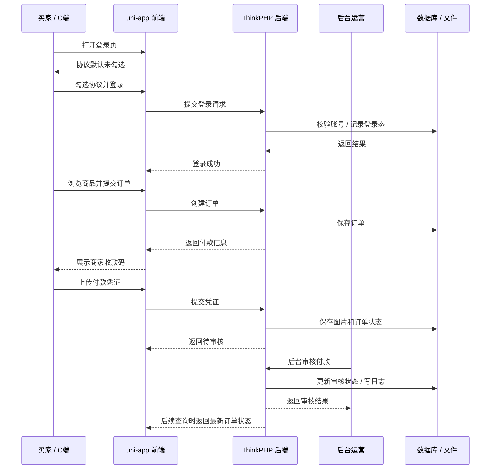
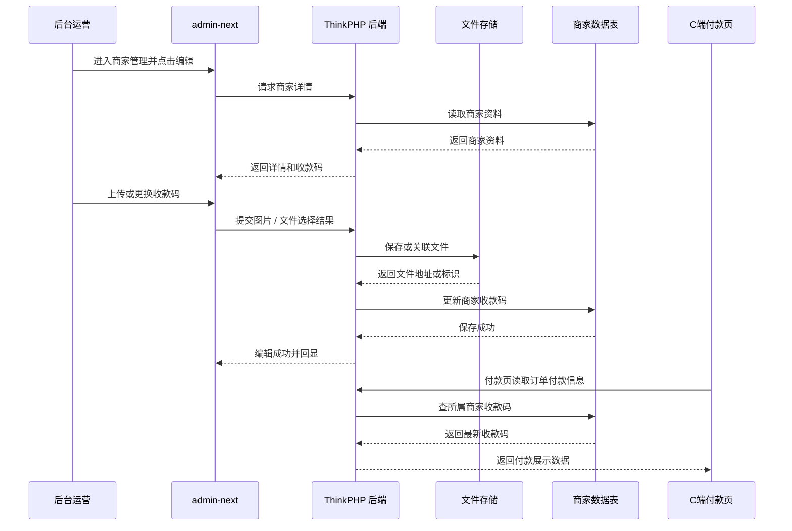
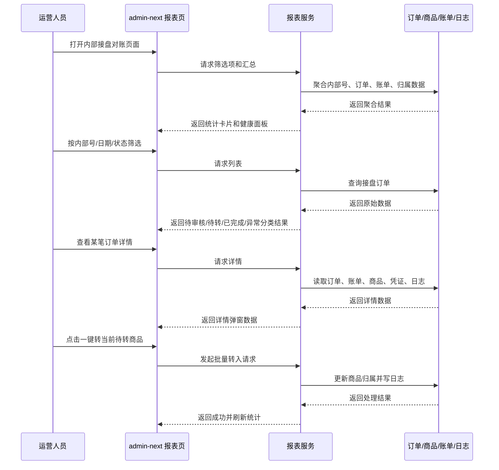
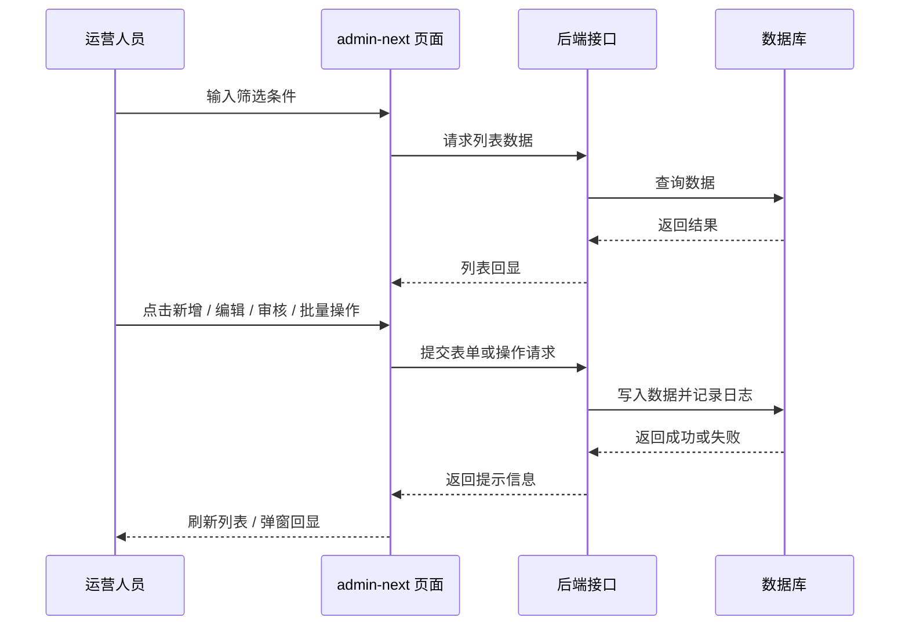

# 系统角色泳道图（前后端协同版）

更新时间：2026-04-30

适用场景：

- 测试拆用例
- 研发对齐前后端职责
- 运营理解各环节由谁处理

## 1. 买家下单到审核完成泳道图

## 2. 商家维护收款码泳道图

## 3. 内部接盘对账泳道图

## 4. 后台栏目通用交互泳道图

## 5. 前后端职责拆分

### 前端负责

- 页面承接和路由可达
- 表单录入、预校验、按钮禁用态
- 列表筛选、详情弹窗、结果回显
- 上传、预览、删除、二次确认

### 后端负责

- 登录态与权限校验
- 业务状态识别
- 订单、商品、账单、商家数据一致性
- 文件保存和实际读写
- 日志、异常、批量处理规则

## 6. 测试拆用例建议

1. 买家登录流程
2. 协议未勾选拦截流程
3. 商品浏览与下单流程
4. 付款凭证提交与后台审核流程
5. 商家收款码维护与前端付款展示联动
6. 内部接盘对账筛选、详情、导出、一键转入
7. 后台各栏目列表、弹窗、批量操作、结果回显

## 7. 导出建议

- Mermaid 支持的 Markdown 编辑器可直接导出 PDF
- Mermaid Live Editor 可导出单张 SVG / PNG
- 也可以把每个泳道图分别导出后放进 PPT 或 Word

