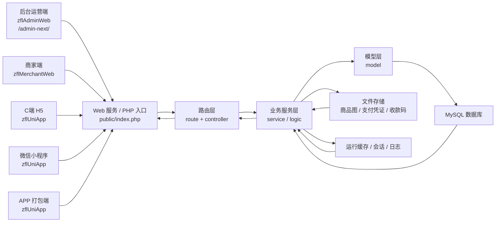
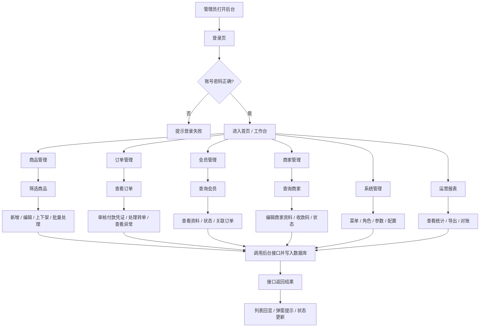
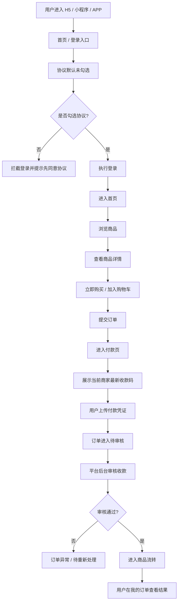
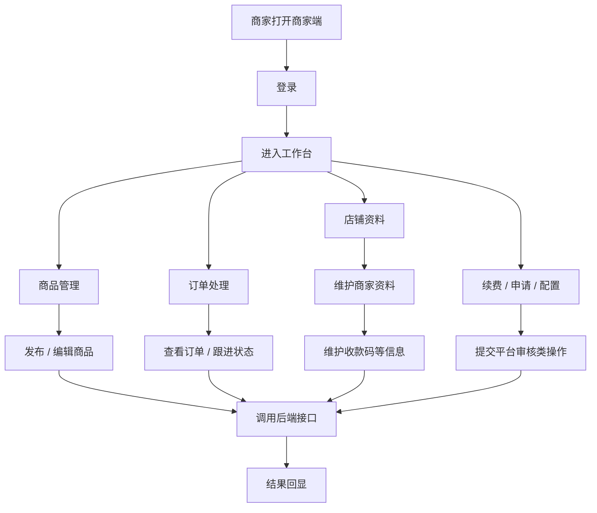
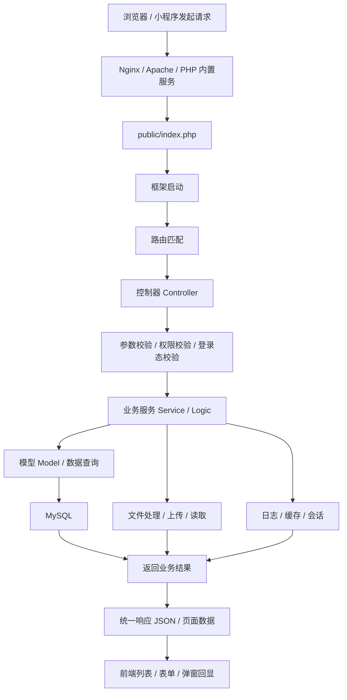
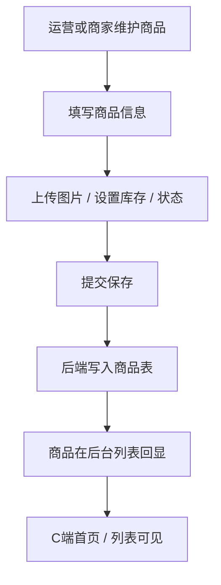
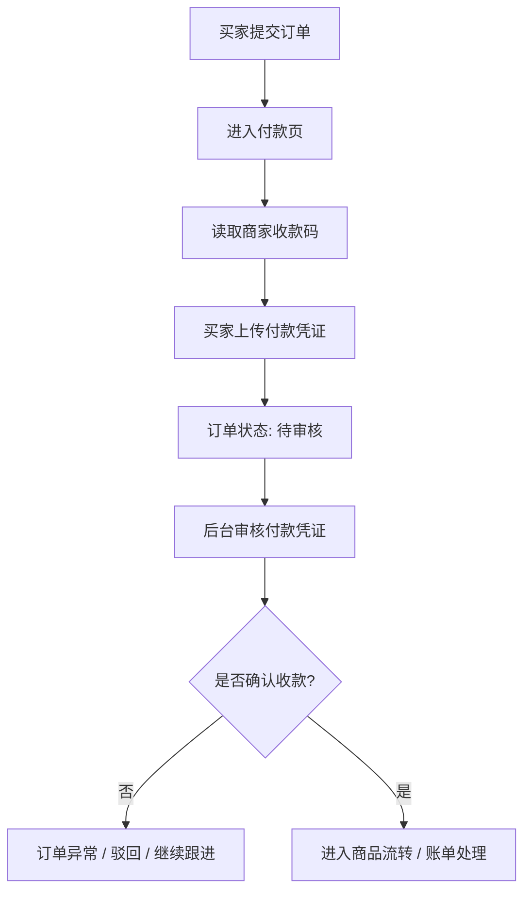
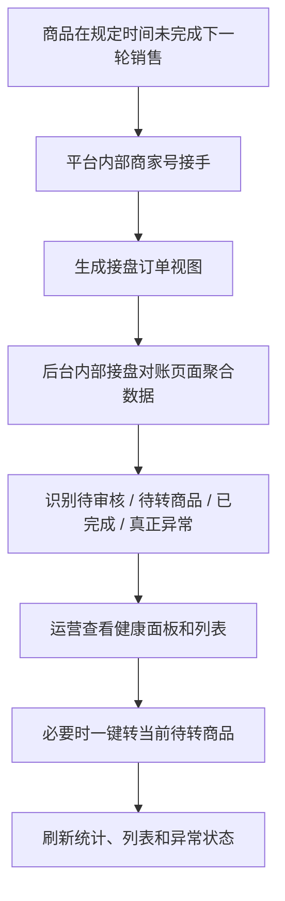
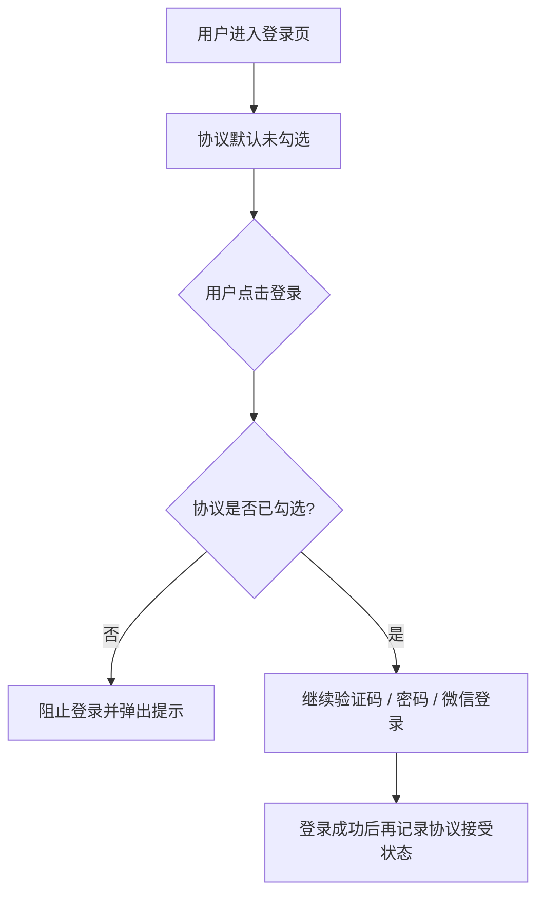

# 系统前后端操作流程图

更新时间：2026-04-30

本文用于说明当前整套系统的前端、后端、核心业务流和数据流转关系，便于研发、测试、运营和上线交接统一理解。

适用范围：

- 后台运营端：`zflAdminWeb`
- 商家端：`zflMerchantWeb`
- C 端 H5 / 小程序 / APP：`zflUniApp\zflUniApp`
- 后端服务：ThinkPHP 主站

## 1. 系统总览

## 2. 角色与入口

### 2.1 后台运营端

- 使用人群：平台管理员、审核员、运营人员、财务人员
- 主要入口：`/admin-next/`
- 主要模块：商品、订单、会员、商家、内容、文件、系统、报表、权限

### 2.2 商家端

- 使用人群：入驻商家
- 主要能力：商品管理、订单处理、续费、资料维护、申请流程

### 2.3 C 端

- 使用人群：买家 / 普通会员
- 覆盖终端：H5、微信小程序、APP 打包端
- 主要能力：登录、浏览商品、下单、上传付款凭证、查看订单、申请商家

## 3. 后台运营流程

## 4. C 端用户流程

## 5. 商家端流程

## 6. 后端请求处理流程

## 7. 核心业务流

### 7.1 商品发布与运营管理

### 7.2 下单支付审核流程

### 7.3 内部接盘对账流程

### 7.4 协议勾选与登录拦截

## 8. 模块与数据关系

### 8.1 前端模块

- 后台运营端：运营配置与审核中心
- 商家端：商家自助操作中心
- C 端：买家访问和下单入口

### 8.2 后端核心模块

- 登录鉴权：管理员、商家、会员登录态校验
- 商品模块：商品信息、归属、状态、图片
- 订单模块：订单创建、支付凭证、审核、流转
- 会员模块：用户资料、登录、订单关联
- 商家模块：商家资料、状态、收款码
- 报表模块：统计、导出、内部接盘对账
- 文件模块：商品图、支付凭证、收款码图片

### 8.3 关键数据对象

- 商家表：商家基础信息、内部号标记、收款码
- 商品表：商品信息、归属商家、状态、价格
- 订单表：订单号、金额、支付状态、审核状态
- 订单商品表：商品明细与数量
- 会员表：买家手机号、昵称、账号信息
- 账单表：账单金额、账单状态、关联订单
- 文件表：图片、凭证、附件
- 日志表：审核、转入、异常处理记录

## 9. 常用页面到后端的映射

| 前端页面 | 主要动作 | 后端处理重点 |
| --- | --- | --- |
| 后台商品管理 | 筛选、批量操作、迁移、上下架 | 商品查询、状态修改、批量更新 |
| 后台订单管理 | 审核付款、查看详情、处理异常 | 订单状态流转、支付审核、日志记录 |
| 后台商家管理 | 编辑商家、维护收款码 | 商家详情读取、保存、文件关联 |
| 后台内部接盘对账 | 汇总、筛选、导出、一键转商品 | 分类识别、健康面板、批量转入 |
| C 端登录页 | 协议勾选、登录 | 协议拦截、登录校验、登录态发放 |
| C 端付款页 | 展示收款码、上传凭证 | 商家收款码读取、凭证保存 |
| 商家端资料页 | 更新商家资料 | 商家保存、审核、回显 |

## 10. 推荐导出方式

### 10.1 导出为 PDF

- 用 Typora 打开本文件，直接导出 PDF
- 用支持 Mermaid 的 Markdown 编辑器打开后导出 PDF
- 用 VS Code + Markdown Preview Mermaid Support 预览后打印成 PDF

### 10.2 导出为图片

- 将单个 Mermaid 图复制到 [Mermaid Live Editor](https://mermaid.live/) 导出 SVG 或 PNG
- 用支持 Mermaid 的编辑器导出页面截图或 SVG

### 10.3 导出为 Word

- 先导出 PDF
- 再转 Word
- 或将 Markdown 转为 `.docx`

## 11. 建议的使用方式

- 给运营：重点看“后台运营流程”和“内部接盘对账流程”
- 给前端：重点看“角色与入口”“前端页面到后端映射”
- 给后端：重点看“后端请求处理流程”和“核心业务流”
- 给测试：按四条主流程拆测试用例

## 12. 后续可继续补的版本

如果你要，我下一步可以在这份基础上继续补两种导出版：

- 版本 A：`PPT 汇报版流程图`
- 版本 B：`测试用例版泳道图`

